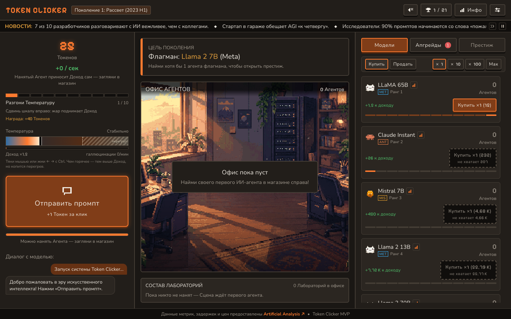
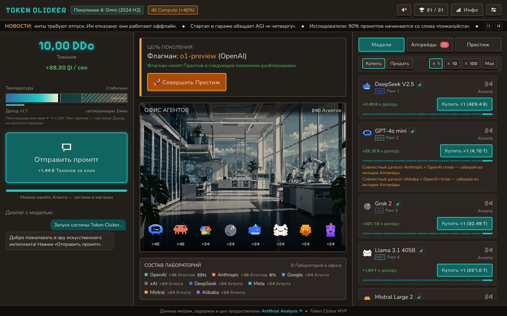
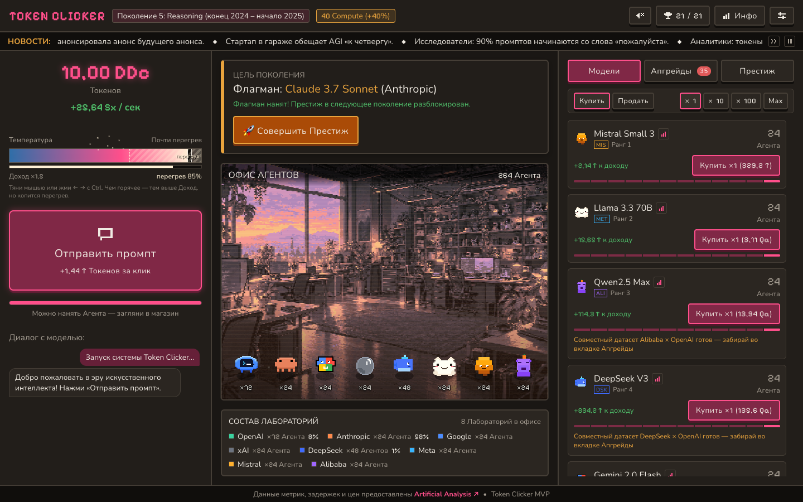
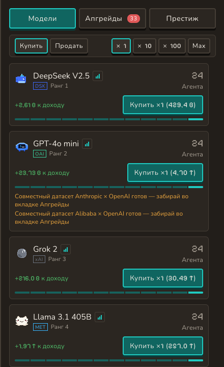
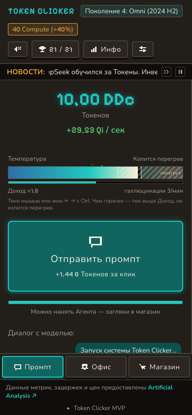

# Token Clicker

Браузерная idle-игра, где ты нанимаешь настоящие ИИ-модели: купленные Агенты стоят в офисе и генерируют Токены, пока вкладка закрыта. Восемь Поколений ИИ, переход между ними через Престиж, а Compute и Перки остаются с тобой навсегда.

## Запуск

```bash
npm install
npm run dev
```

Открой http://localhost:5173 — это вся установка. Игра целиком в браузере: ни сервера, ни аккаунтов. Прогресс лежит в этом браузере, и в настройках его можно выгрузить кодом, а потом загрузить обратно.

## Температура

Шкала слева — не апгрейд за Токены. Это параметр, который ты двигаешь сам, пока играешь.

Чем горячее, тем больше Доход: в холоде он ровно базовый, на единице шкалы — в 2,2 раза выше, а на пределе почти втрое.

Жар имеет цену. Чем выше Температура, тем быстрее копится перегрев, который срезает Доход, и тем чаще прилетают Галлюцинации, отнимающие часть кошелька.

Дойдёт полоса перегрева до края — шкала сама сбросится в холод, офис остынет, а Доход на несколько секунд провалится.

Поэтому играют рывками: поднял жар, забрал Токены, остудил. Постоянно держать шкалу вверху нельзя.

## Как выглядит



Первый забег. Цель Поколения названа словами, шкала Температуры на месте сразу, а первый Агент уже по цене.



Поздняя игра. Офис полон Агентов, счётчик Токенов уехал в большие числа, а Флагман уже открыл Престиж.



Жар вблизи края шкалы. Доход ещё высокий, но перегрев уже копится и скоро обрушит шкалу в холод.



Магазин. Ранг, цена и Доход у каждой Модели разные, а отметка у названия открывает «Справку AA» с реальными характеристиками.



Узкий экран. Три колонки сворачиваются в одну, вкладки переезжают на нижнюю панель.

## Данные

Метрики, задержки и цены API — [Artificial Analysis](https://artificialanalysis.ai). По ним считаются Ранг, цена и Доход Моделей; в игре те же цифры видны в «Справке AA» у названия каждой Модели.